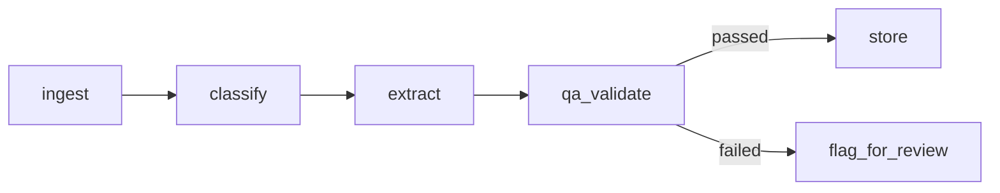

# Architecture

## Pipeline flow

Implemented as a LangGraph `StateGraph` (`src/pipeline.py`). Each node reads
and returns the same `PipelineState` TypedDict, so adding a node (e.g. a
deduplication step) means adding one function and one edge — the rest of
the graph doesn't change.

## Extraction backends

`src/extractor.py` defines a common `BaseExtractor` interface with two
implementations:

| Backend | When used | Dependencies |
|---|---|---|
| `HeuristicExtractor` | Default — no API key required | none |
| `LLMExtractor` | `ANTHROPIC_API_KEY` env var is set | LangChain + `langchain-anthropic` |

Both return the same `DocumentExtraction` schema (`src/schema.py`), so
swapping backends doesn't touch the pipeline, the QA layer, or the API.
The heuristic backend also serves as an evaluation baseline: it's cheap
to run against the whole corpus and gives a sanity check for what the
LLM backend's outputs should roughly look like.

## Scaling to the full 50,000+ document corpus

`src/batch_process.py` iterates the raw folder and calls the same
per-document pipeline used by the API. At 50k+ documents the only change
needed is parallelizing that loop (e.g. a process pool or a task queue)
— there's no per-document state shared across the graph, so documents
are embarrassingly parallel.

## REST API

`src/api.py` (FastAPI) exposes the pipeline over HTTP:

- `POST /documents` — single-document synchronous processing
- `POST /batch/process` — reprocess the whole raw folder
- `GET /documents`, `GET /documents/{id}` — query results
- `GET /qa/report` — aggregate data-quality report
- `GET /health` — liveness check

Interactive docs are auto-generated at `/docs` (Swagger UI) once the
server is running (`uvicorn api:app --reload`).

## Data quality control (QA)

See [`qa_protocol.md`](qa_protocol.md) for the full rule set. In short:
every extraction is scored against explicit rules (confidence threshold,
summary completeness, category resolution, topic coverage); anything
that fails is routed to `flag_for_review` rather than being silently
accepted or dropped.
